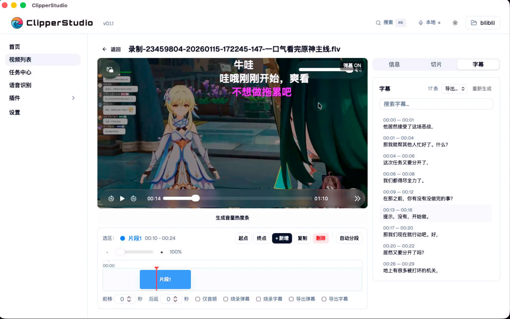
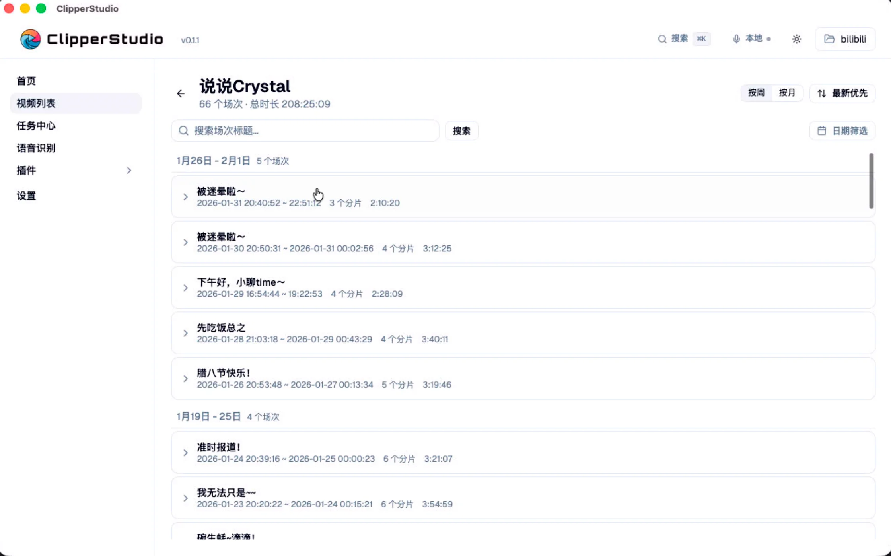

# ClipperStudio

 直播录播切片创作者打造的桌面级视频工作台。
 
[English](#english)

---

## 这是什么

ClipperStudio 想解决一件事：把一段几个小时的直播录像，变成几条能直接发出去的短视频片段，整个过程尽量不让你来回切换工具。

它把素材管理、播放预览、ASR 字幕、弹幕压制、切片导出这些事放到一起，本地跑、本地存，不依赖任何在线服务。需要 AI 能力的时候，可以挂自己的大模型；不需要的时候，纯离线也能用。

## 界面预览

## 主要能力

- **素材库与工作区**：扫描本地目录，自动识别录播姬等录制工具产出的目录结构，按主播 / 场次组织视频。
- **播放与切片**：基于原生播放器的工作台界面，支持精准跳转、In/Out 点标记、批量导出切片。
- **ASR 字幕**：可接入 Qwen3-ASR 等服务作为插件，自动转写并以绝对时间戳入库，方便长时间跨文件对齐。
- **弹幕压制**：导入弹幕（XML / JSON），渲染到视频画面或导出为 ASS。
- **任务调度**：所有耗时操作走统一的任务队列，可暂停、重试、批量取消，不会卡死界面。
- **插件体系**：ASR / LLM / 录制等服务级能力以插件形式扩展，HTTP 或 stdio 协议接入，业务代码无需感知差异。
- **依赖管理器**：FFmpeg 这类外部依赖在应用内按需下载，不再让你为安装环境而烦恼。

## 技术栈

| 层 | 技术 |
|---|---|
| 桌面框架 | Tauri 2.x（Rust） |
| 前端 | Vite 6 + React 19 + TypeScript |
| UI | shadcn/ui + Tailwind CSS 4 |
| 路由 / 数据 | TanStack Router + TanStack Query |
| 状态 | Zustand（仅 UI 瞬态） |
| 数据库 | SQLite（sea-orm 建模 + raw SQL，WAL 模式） |
| 媒体处理 | FFmpeg / FFprobe |

架构上分三层：表现层（前端 UI）、核心层（Rust 业务）、外部服务层（通过插件接入）。前后端只通过 Tauri IPC 通信，不开 HTTP 端口；所有异步任务走调度器，IPC handler 不会阻塞。

## 用户文档

使用上的问题、功能介绍和上手教程都在这里：[`docs/`](./docs/)。

## 参与开发

想从源码跑起来、提交代码或者写插件？请移步：

- [`development.md`](./development.md) — 本地环境、构建、测试、基准测试、调试与 PR 流程
- [`contribute.md`](./contribute.md) — 插件开发指南

## License

[MIT](./LICENSE)

## Buy me a coffee
点个 Star 喵，点个 Star 谢谢喵。

本工具不含任何古法编程的成分，但是人工介入还是有的，尽可能不让它炸就是了，这年头谁还古法编程呢（摊手）

感谢GLM的无周限版本套餐提供的大力支持，虽然没可能买到了，这价格要啥自行车呢。

本项目灵(xu)感(qiu)来源于B站切片UP主麻糕，关注[麻糕](https://space.bilibili.com/89145162)喵，关注[麻糕](https://space.bilibili.com/89145162)谢谢喵。

---

## English

ClipperStudio is a desktop workbench for people who turn long livestream recordings into short, postable clips. It puts media library, playback, ASR subtitles, danmaku rendering, and clip export into one local-first app — nothing leaves your machine unless you wire up an external service yourself.

Built with **Tauri 2.x (Rust) + Vite 6 + React 19 + TypeScript**, with SQLite as the single source of truth and FFmpeg for media work. AI features (ASR, LLM-based translation, highlight detection) are pluggable; the core works fully offline.

### Highlights

- **Library & workspaces** — scans local folders, understands recorder layouts (e.g. BililiveRecorder), organizes by streamer / session.
- **Player & clipping** — frame-accurate seek, In/Out markers, batch export.
- **ASR subtitles** — plug in providers like Qwen3-ASR; transcripts are stored with absolute timestamps so they survive across files.
- **Danmaku rendering** — burn into video or export as ASS.
- **Task scheduler** — long-running jobs go through a unified queue with pause / retry / cancel; the UI never blocks.
- **Plugin system** — services (ASR / LLM / recorders) speak HTTP, tools speak stdio, business code calls them through one trait.
- **Dependency manager** — FFmpeg and friends are downloaded on demand from inside the app.

### User Docs

Usage guides, feature walkthroughs, and onboarding live under [`docs/`](./docs/).

### Contributing

Looking to build from source, hack on the core, or ship a plugin?

- [`development.md`](./development.md) — local setup, build, tests, benches, debugging, and PR workflow
- [`contribute.md`](./contribute.md) — plugin development guide

### License

Released under the [MIT License](./LICENSE).
